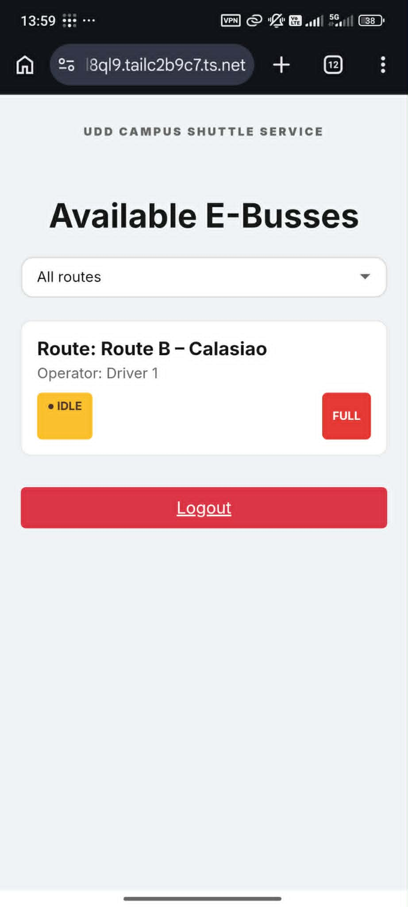
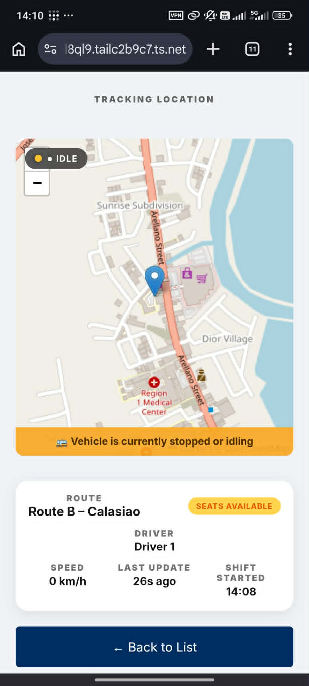
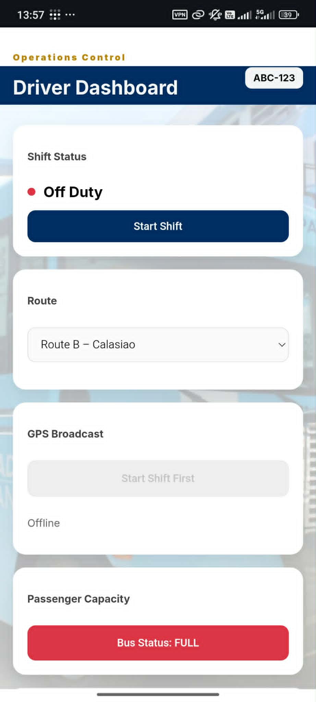
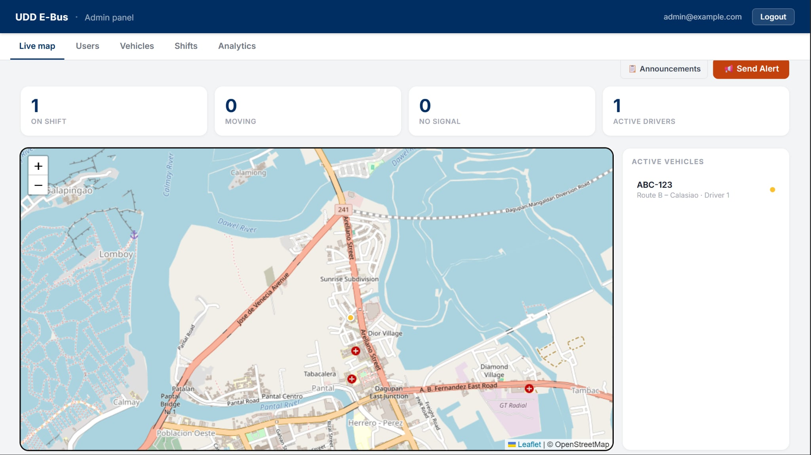
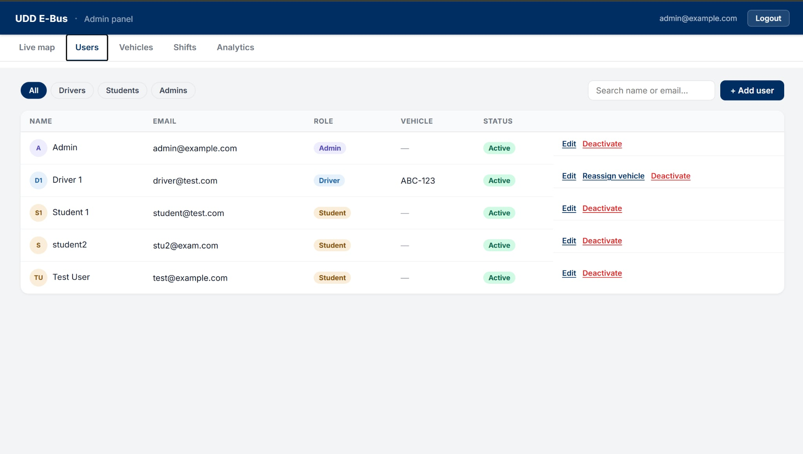
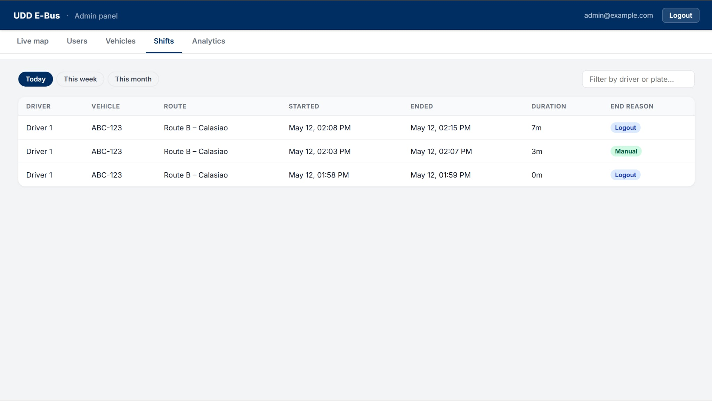
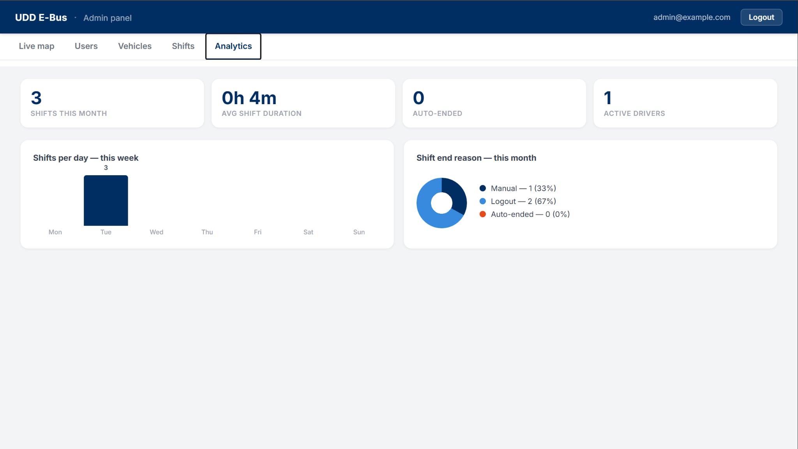

<div align="center">

# 🚌 UDD E-Bus Tracker

**Real-time jeepney tracking for Universidad De Dagupan**

Drivers broadcast their GPS live from their phones. Students watch the map update in real time. Admins manage the fleet and push alerts — all from one web app.

[](https://laravel.com)
[](https://php.net)
[](https://reverb.laravel.com)
[](https://leafletjs.com)
[](https://tailwindcss.com)
[](LICENSE)

</div>

---

## Screenshots

| Student — Active Jeeps                                                              | Student — Live Tracking                                                       |
| ----------------------------------------------------------------------------------- | ----------------------------------------------------------------------------- |
|  |  |

| Driver Dashboard                                                                             |
| -------------------------------------------------------------------------------------------- |
|  |


| Admin — Live Map                                                                                                                                                                                                                                                                                                                                                                |
| ------------------------------------------------------------------------------------------------------------------------------------------------------------------------------------------------------------------------------------------------------------------------------------------------------------------------------------------------------------------------------- |
|  |
|                                                                                                                                                                                                                                                                                                                                                                                 |


---

## Features

###  Driver
- Start / end shifts with a single tap
- Select a route before going on shift
- Toggle GPS broadcast — position sent via WebSocket whisper (< 100 ms) and synced to the database every 5 s
- Toggle passenger capacity between **Available** and **Full**
- Shift auto-ends after 20 minutes of no GPS signal

###  Student
- See every active vehicle with live status: **● LIVE**, **● IDLE**, **◌ NO SIGNAL**
- Filter by route
- Tap a card to open a live-tracking map with a smoothly animated marker
- Info panel: route, driver, speed, live last-seen ticker, shift start time, capacity
- Toast notifications on GPS status changes
- Full-screen prompt when a shift ends
- **Admin announcements** appear as dismissible banners instantly — no refresh needed

###  Admin
- **Live map** — color-coded vehicle dots, clickable sidebar, real-time stats
- ** Send Alert** — push a text announcement to all students, scoped to a route or global, with expiry presets (2 h / 4 h / midnight / manual)
- **Users** — create, edit, deactivate / reactivate accounts, assign vehicles to drivers
- **Vehicles** — add, edit, remove vehicles, reassign drivers
- **Shifts** — searchable log filtered by today / week / month, with duration and end reason
- **Analytics** — shifts-per-day bar chart, end-reason donut chart, monthly totals

---

## Tech Stack

| Layer | Choice |
|---|---|
| Backend | Laravel 11 |
| WebSockets | Laravel Reverb (self-hosted) |
| Real-time client | Laravel Echo + Pusher JS |
| Maps | Leaflet.js + OpenStreetMap |
| Frontend build | Vite |
| CSS | Tailwind CSS + custom component classes |
| Database | MySQL (SQLite for local dev) |

---

## Quick Start

### Prerequisites
- PHP 8.2+, Composer
- Node.js 18+
- MySQL (or SQLite for local dev)

### 1. Clone & install

```bash
git clone https://github.com/your-username/udd-ebus-tracker.git
cd udd-ebus-tracker
composer install
npm install
```

### 2. Environment

```bash
cp .env.example .env
php artisan key:generate
```

Edit `.env` with your database and Reverb credentials:

```env
DB_CONNECTION=mysql
DB_DATABASE=ebus
DB_USERNAME=root
DB_PASSWORD=

BROADCAST_CONNECTION=reverb
REVERB_APP_ID=your-app-id
REVERB_APP_KEY=your-app-key
REVERB_APP_SECRET=your-app-secret
REVERB_HOST=localhost
REVERB_PORT=8080
REVERB_SCHEME=http

VITE_REVERB_APP_KEY="${REVERB_APP_KEY}"
```

### 3. Database

```bash
php artisan migrate
```

### 4. Build & run

```bash
npm run build                # or: npm run dev (hot-reload)
php artisan reverb:start     # WebSocket server — keep running
php artisan schedule:work    # task scheduler — keep running
php artisan serve
```

### 5. Create an admin account

```bash
php artisan tinker
```
```php
App\Models\User::create([
    'name'      => 'Admin',
    'email'     => 'admin@udd.edu.ph',
    'password'  => bcrypt('your-password'),
    'role'      => 'admin',
    'is_active' => true,
]);
```

Log in at `http://localhost:8000` and create driver / student accounts from the Users tab.

> **Production** — add `* * * * * cd /path-to-app && php artisan schedule:run >> /dev/null 2>&1` to your server's crontab instead of running `schedule:work`.

---

## How It Works

### GPS pipeline (driver → students)

The driver's phone calls `navigator.geolocation.watchPosition`. Each fix is sent two ways at once:

1. **WebSocket whisper** (instant, peer-to-peer) — the tracking page receives the position without it touching the server, giving sub-100 ms updates
2. **HTTP POST every 5 s** — persists `lat`, `lng`, `speed`, `last_seen`, and `route_name` to the database and triggers a server broadcast for any clients that missed a whisper

### GPS status lifecycle

<details>
<summary>GPS status lifecycle</summary>


</details>
### Announcements

Admin sends an alert → `AnnouncementBroadcast` fires on the public `announcements` channel → every connected student sees a banner within milliseconds. Deactivating it removes the banner from all open pages instantly. Route-scoped announcements only appear on the relevant vehicle's tracking page.

<details>
<summary>Full architecture diagram</summary>


</details>

---

## Roles & Access

| Role | Redirects to | Can access |
|---|---|---|
| `driver` | `/driver/dashboard` | Dashboard, GPS API, shift API |
| `student` | `/student/active-jeeps` | Active jeeps list, tracking pages |
| `admin` | `/admin/dashboard` | Everything above + all admin APIs |

Accounts with `is_active = false` are rejected at login even with correct credentials.

---

## API Reference

<details>
<summary>Public — no auth required</summary>

| Method | Endpoint | Description |
|---|---|---|
| `GET` | `/api/vehicles/active` | All vehicles currently on shift |
| `GET` | `/api/vehicles/{id}` | Single vehicle detail |

</details>

<details>
<summary>Driver — auth required</summary>

| Method | Endpoint | Description |
|---|---|---|
| `POST` | `/driver/shift/start` | Start a shift |
| `POST` | `/driver/shift/end` | End a shift |
| `POST` | `/api/gps/update` | Push GPS coordinates |
| `POST` | `/api/vehicles/occupancy` | Toggle full / available |
| `POST` | `/api/driver/route` | Change route mid-shift |

</details>

<details>
<summary>Admin — auth + admin role, prefix <code>/admin</code></summary>

| Method | Endpoint | Description |
|---|---|---|
| `GET` | `/api/users` | List users |
| `POST` | `/api/users` | Create user |
| `PUT` | `/api/users/{user}` | Edit user |
| `POST` | `/api/users/{user}/deactivate` | Disable account |
| `POST` | `/api/users/{user}/reactivate` | Re-enable account |
| `POST` | `/api/users/{user}/assign-vehicle` | Assign vehicle to driver |
| `GET` | `/api/vehicles` | Full vehicle list |
| `POST` | `/api/vehicles` | Add vehicle |
| `PUT` | `/api/vehicles/{vehicle}` | Edit vehicle |
| `DELETE` | `/api/vehicles/{vehicle}` | Remove vehicle |
| `POST` | `/api/vehicles/{vehicle}/assign-driver` | Assign driver to vehicle |
| `GET` | `/api/shifts` | Shift log (filterable by range + search) |
| `GET` | `/api/analytics` | Analytics data |
| `GET` | `/api/announcements` | All announcements |
| `POST` | `/api/announcements` | Send announcement |
| `POST` | `/api/announcements/{id}/deactivate` | Deactivate announcement |
| `DELETE` | `/api/announcements/{id}` | Delete announcement |

</details>

---

## Project Structure

```
app/
├── Console/Commands/
│   └── CheckInactiveVehicles.php
├── Events/
│   ├── VehicleLocationUpdated.php
│   ├── VehicleStatusChanged.php
│   └── AnnouncementBroadcast.php
├── Http/
│   ├── Controllers/
│   │   ├── AdminController.php
│   │   ├── StudentController.php
│   │   └── Api/
│   │       ├── GpsController.php
│   │       ├── ShiftController.php
│   │       ├── VehicleController.php
│   │       ├── RouteController.php
│   │       └── AnnouncementController.php
│   └── Middleware/EnsureRole.php
└── Models/
    ├── Vehicle.php
    ├── User.php
    ├── Shift.php
    ├── Announcement.php
    └── Location.php

resources/js/modules/
├── driver-dashboard.js
├── tracking.js
├── active-jeeps.js
├── admin-dashboard.js
├── announcements.js
└── login.js

routes/
├── web.php
├── api.php
└── channels.php
```

---

## License

This project was developed as an academic capstone project for **Universidad De Dagupan** and is intended for **educational purposes only**.

- ✅ You may study, reference, and learn from this code
- ✅ You may fork it for your own academic or personal learning
- ❌ Commercial use is not permitted
- ❌ Redistribution as your own work is not permitted

All rights reserved by the original authors.

---

<div align="center">
Built with ❤️ for Universidad De Dagupan
</div>